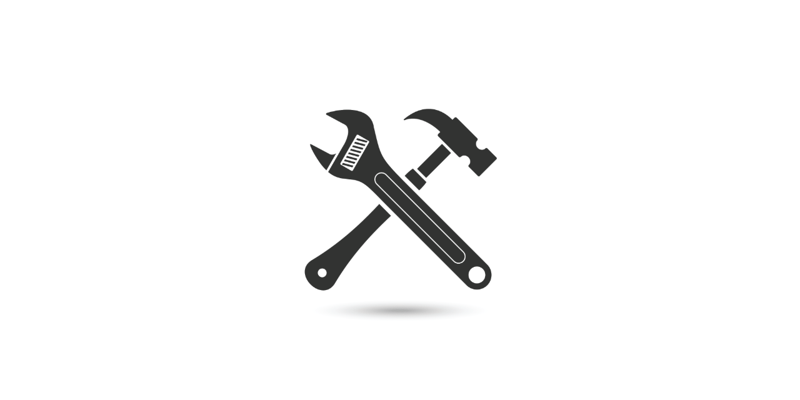
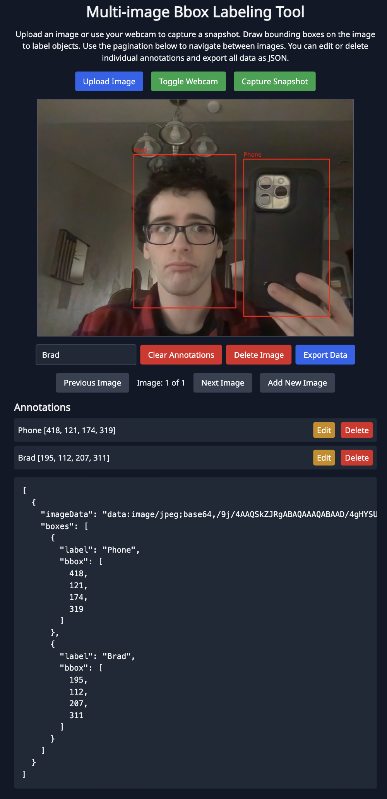
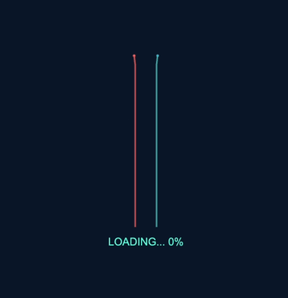
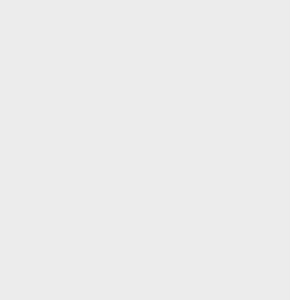
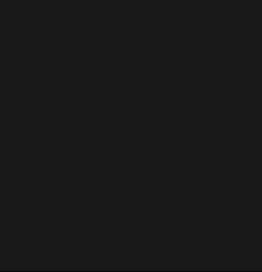
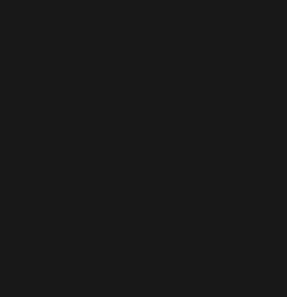
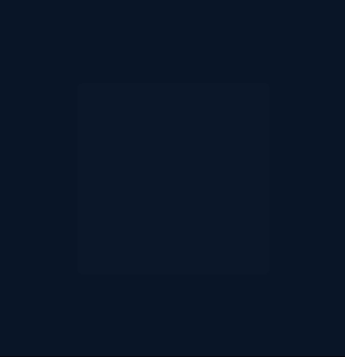
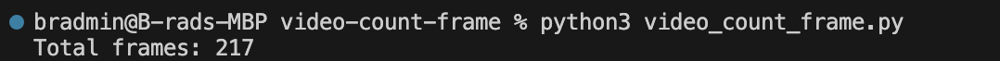

# Demos
<!--
- TODO need to add metadata to loading screens
- TODO update gists
- TODO update readme
- TODO update profile readme
-->

## Machine Learning

### COCO Real-Time Object Detection (Standalone HTML, MIT License)

Demo:

---

### Multi-Image Bbox Labeling Tool for COCO-SSD Annotations (Standalone HTML, MIT License)

Demo:

---

## Loading Screen Components

### DNA Annealing Loading Screen React Component (MIT License)

Demo:

### Dot Matrix Loading Screen React Component (MIT License)

Demo:

### Test Tube Loading Screen React Component (MIT License)

Demo:

### Three Ball Loading Screen React Component (MIT License)

Demo:

### Waveforms Loading Screen React Component (MIT License)

Demo:

---

## Other

### Video Frame Counter for Texture Animations in Blender (MIT License)

Demo:
  

---